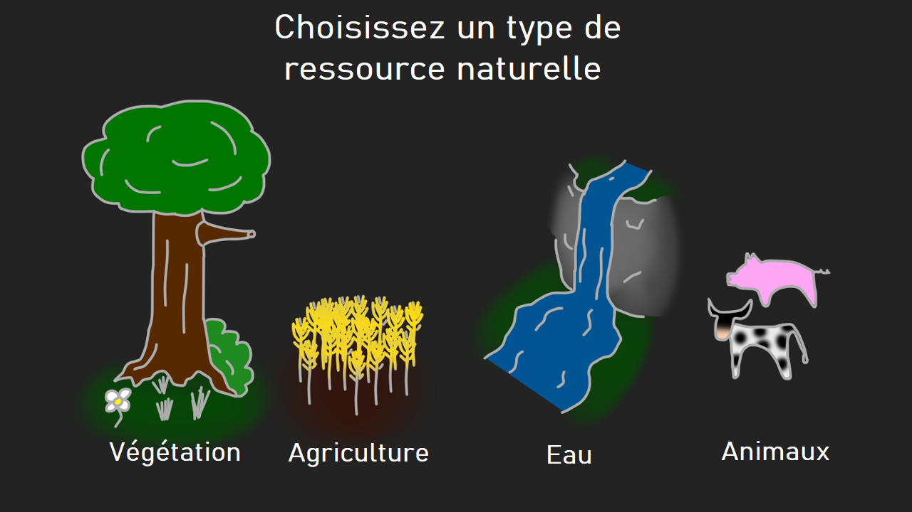
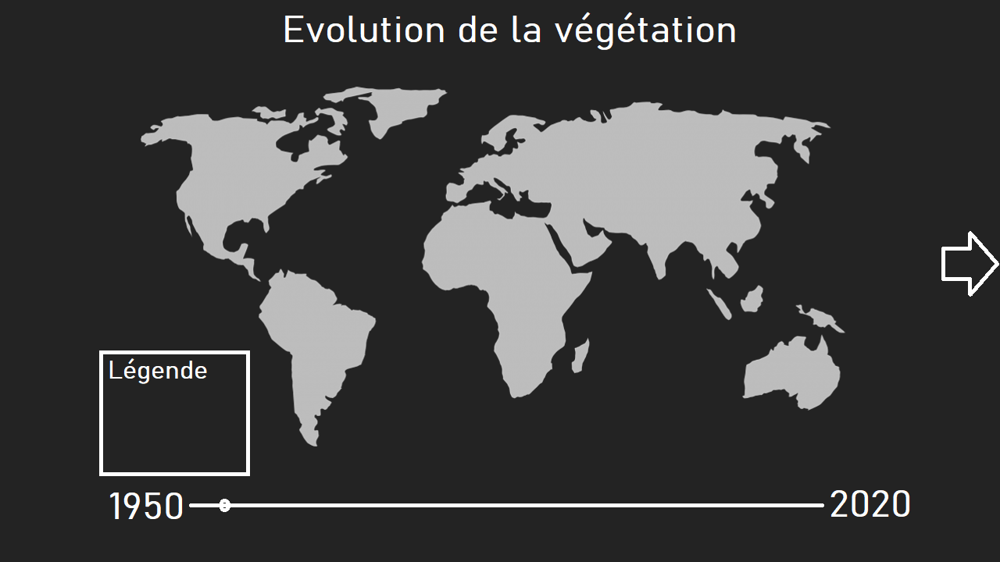
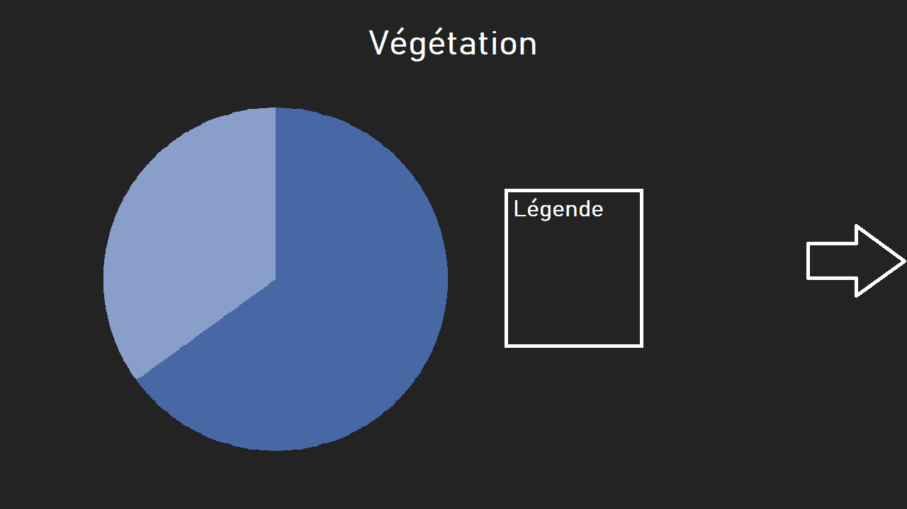
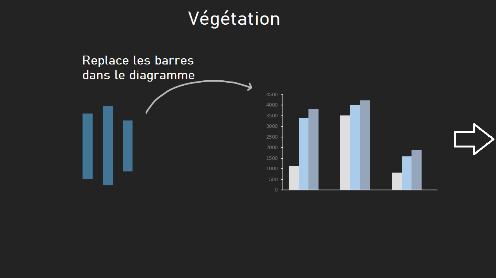
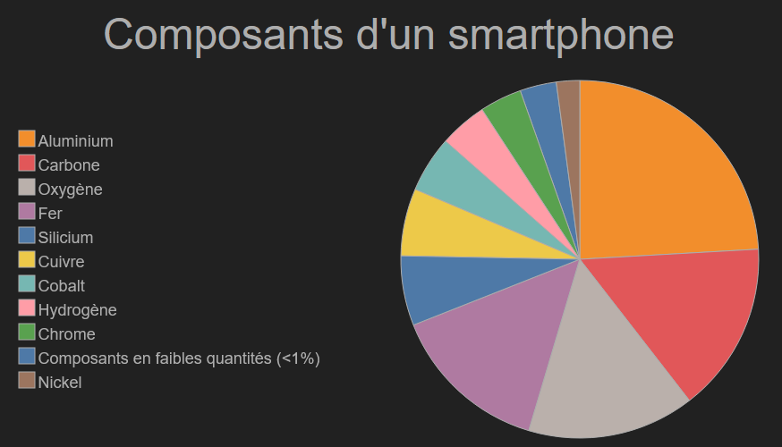
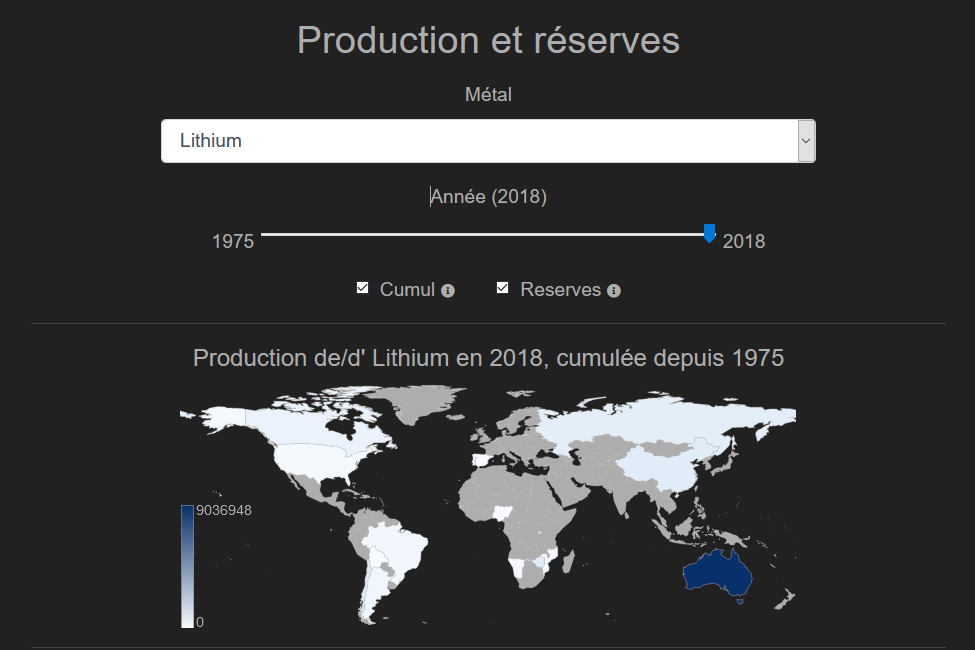
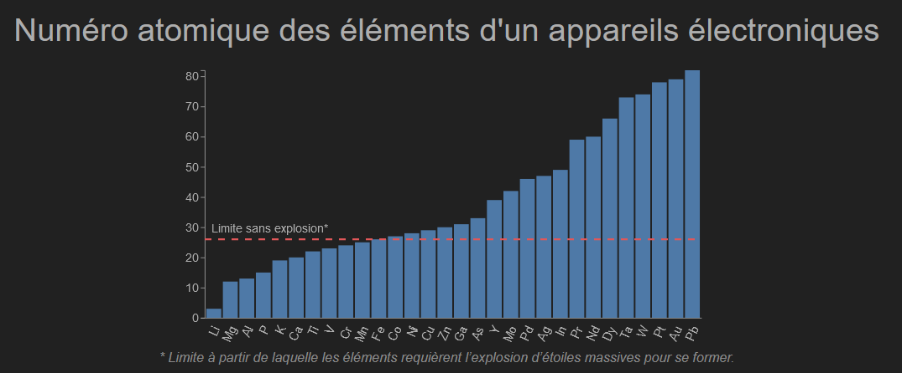

# Document de suivi - Evolution des ressources de la planète au fil du temps

## Problématique
L'objectif de notre visualisation est de visualiser l’évolution des ressources de la planète au fil du temps

### Données:

Nous allons utiliser les données suivantes:

http://www.fao.org/faostat/en/#data

### Etat de l'art :

https://www.globalforestwatch.org/map/
https://ourworldindata.org/natural-disasters

### Esquisses : 02/12/2020

### Peer review 13/12/2020

Nous avons pris en compte les remarques qui nous avons été faites. On
a donc pris la décision de nous concentrer sur un seul type de ressources : les métaux.

### 26/12/2020

Nous avons redéfini le projet et sa problématique.
Le nouvel objectif de notre visualisation et de maintenant pouvoir observer la production des ressources en métaux qui composent un iPhone.

### 02/01/2021

- Création du template avec l'effet parallax.

### 07/01/2021

Pour obtenir de nouvelles données, nous avons utilisé ce site qui nous retourne la production mondiale d'un métal dans un intervalle de temps qui est limité à 10 ans:

https://www2.bgs.ac.uk/mineralsuk/statistics/wms.cfc?method=searchWMS

Ne pouvant pas générer de CSV contenant toutes les données que nous recherchions, nous avons du agréger les données à la main dans un nouveau CSV.

### 09/01/2021
- Ajout du diagramme circulaire.

###  10/01/2021
- Ajout de la carte traduite et correction des légendes et tooltips
- Ajout et correction des données.
- Modification du CSS.
- Modification du diagramme circulaire.
- Ajout de code pour la carte interactive.
- Ajout de la carte traduite en français et corrections des légendes

###  11/01/2021
- Correction de la légende du diagramme circulaire
- Intégration de la carte

- Correction des données

### 12/01/2021
- Ajout et correction du diagramme en barre

